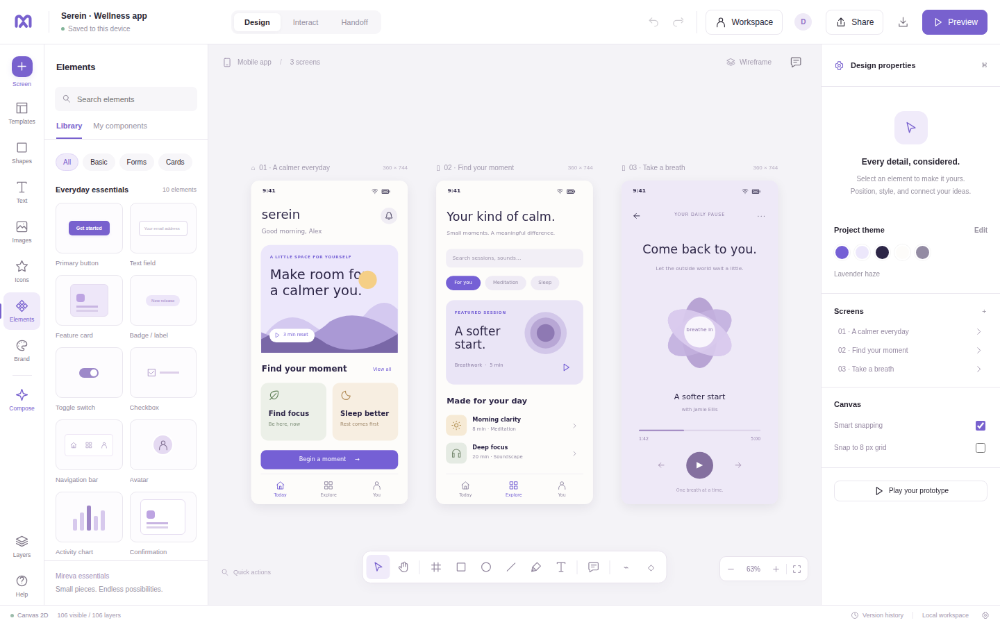

# Mireva Studio 0.2.0

A local-first interface design studio with a plain JavaScript editor, native WebGPU compositing, an editable multi-screen canvas, prototypes, verified accounts, organization workspaces and persistent collaboration. Original application code; no frontend framework, CDN, runtime npm dependencies or borrowed product branding.



## Browser editor and source

[Open Mireva Studio](https://wieslawsoltes.github.io/MirevaStudio/) · [Source repository](https://github.com/wieslawsoltes/MirevaStudio)

The Pages deployment is the local-first editor, not the Node backend. It intentionally does not request account APIs from GitHub Pages. Use the included server for accounts, organization administration, live collaboration and connected AI. The Workspace button explains this distinction in the static editor.

Pushes to `main` run the checks, tests and build before publishing `dist/`. Deployment metadata is available at `build-info.json`. No server data, `.env` file, account credentials or API keys are included in the Pages artifact.

## Run

Use **Node.js 22.16 or later**. This release was exercised on Node 22.16.0; its built-in SQLite API prints an experimental warning on that runtime.

```sh
npm start
# Open http://localhost:4173
```

No `npm install` step is required. The server initially binds to loopback. To use it from another device on a trusted development network:

```sh
HOST=0.0.0.0 PORT=4173 npm start
```

For Internet hosting, configure HTTPS and the controls in [DEPLOYMENT.md](docs/DEPLOYMENT.md). Do not expose development mode as a public service.

Run `npm run build` to create `mireva-studio.html`, which works as a standalone local editor. `npm run build` recreates it and `dist/index.html`. Accounts, durable shared projects, emailed invitations, public prototypes and server-side model requests need the Node server. Static hosting alone does not provide those services. Serve the editor and its account API on the same origin.

## What changed in 0.2

| System | Working implementation |
| --- | --- |
| Identity | Email verification and resend, password recovery/change, signed-in profile, revocable sessions, CSRF-protected cookie authentication, TOTP authenticator setup and one-use recovery codes. |
| Single sign-on | OIDC authorization-code flow with PKCE, state, nonce, discovery/JWKS validation, RS256/ES256 signature verification, explicit account linking and unlinking, organization-required identity provider. |
| Organizations | Owner/admin/member/viewer roles, verified email-bound invitations, last-owner protection, policy controls, member/project/storage/model budgets, archive/restore, project-role overrides, versioned shared libraries and palettes, paged audit history and retention. |
| Rich text | Character-level sequence CRDT, independent range-format registers, Unicode text, bold/italic/underline/strike, colors, highlighting, font/size/link ranges, composition input, stable caret anchors and selective undo. Native contenteditable controls feed real operations. |
| Vectors | Bézier pen, anchors and handles, smooth/corner/symmetric modes, point insertion/deletion, split/open/close/reverse, curved path normalization/resizing and worker-backed union/intersection/difference/exclusion with retained source shapes. |
| Persistence | SQLite WAL transactions, encrypted compressed document payloads, an incremental operation journal, retry receipts, restart replay, periodic compaction, online backup and verified restore. Multiple processes can share one local database. |
| Publishing | Hosted read-only prototype snapshots with expiration and revocation, isolated from account cookies, plus standalone HTML prototypes. |
| Interchange | Editable SVG metadata round-trip, expanded safe SVG import, documented design REST JSON import, Sketch ZIP import, and native portable ZIP packages. Conversion warnings are explicit. |
| Model integration | Server-controlled chat/Responses/Ollama adapters, text and image payloads, contextual generation, strict output validation, asynchronous jobs, cancellation, retries, encrypted per-organization credentials and request budgets. |

The editor retains the previous multi-screen drawing, selection, eight resize grips, snapping, groups, layers, styles, components, frame constraints, row/column layout, local templates, undo/redo, comments, PNG/SVG/native export and interactive prototypes. There are light/dark appearances and a responsive shell.

## First shared workspace

Open **Workspace** in the header, create an account and follow its verification email. In development only, queued emails are written under `.mireva-data/development-mail/`; open the generated JSON locally and follow the verification URL in its text. Those files are not served over HTTP. Production registration needs configured SMTP or an HTTPS mail webhook.

After signing in, create an organization or use your personal workspace, then save the current design as a cloud project. Use **People** for email-bound team invitations, **Team library** for versioned assets, and **Policies** for sharing/SSO/budget rules. Project **Sharing & publishing** controls role overrides and public prototypes. Authentication secrets are never embedded in exported projects.

The original guest collaboration flow is still available in development through **Share**. It uses expiring bearer invitations. Anyone possessing the same guest invitation shares its identity; use verified organization membership for accountable collaboration.

## Editing

Double-click text to enter character-level editing. Select a range and use the floating formatting toolbar. Changes are sent while you type. Ctrl/Cmd+Enter ends editing; Ctrl/Cmd+Z selectively undoes local work.

Choose **Bézier pen** in the canvas toolbar or press Shift+P. Click for a corner, drag for handles, click the first point to close, or press Enter to finish. Select a vector and use **Edit anchor points** in the inspector. Shift selects multiple anchors, Alt breaks handle symmetry, and Shift constrains a dragged handle to 45-degree directions.

Select two or more filled shapes with the same parent to enable Boolean operations. Original operands remain hidden in Layers and can be recovered with undo or the visibility control. Curved boundaries use an explicit 0.25-pixel flattening tolerance, not an exact analytic curve-intersection solver.

Use the project menu/import file picker or drop files onto the editor. Supported files are `.mireva`, `.mireva.zip`, `.svg`, documented design REST `.json`, `.sketch`, and supported raster images. See [FORMAT_COMPATIBILITY.md](docs/FORMAT_COMPATIBILITY.md) before expecting third-party fidelity.

## Verification

```sh
npm run check
npm test
npm run build
```

This delivery passed **57 Node test cases** in the test runner, **12 original browser acceptance groups**, **12 account/vector/rich-text UI groups**, **6 interchange/CSP browser groups**, a two-browser simultaneous rich-text/offline/reconnect test, both standalone modes, and a real WebGPU framebuffer readback. The browser checks ran with CSP enforcement enabled. The GPU adapter was software Vulkan, not a physical GPU.

A separate test kills two Node processes after acknowledged edits and confirms WAL recovery. An online backup was restored into a new directory and its database, payloads and audit chain checked. A bounded loopback load check exercised 8 writers, 1,001 records and 240 acknowledged edit batches without lost final updates. These checks are not a security audit or a hosted-service capacity certification. Details, artifacts and reproducible commands are in [TESTING.md](docs/TESTING.md).

## Files and documentation

- `src/core/`: validated scene store, character CRDT, geometry, vector kernel, commands and templates.
- `src/render/`: WebGPU compositor, retained raster atlases, mixed-style text layout and Canvas fallback.
- `src/services/`, `src/ui/`: transport, IndexedDB, formats, editor controllers and workspace UI.
- `server/`: HTTP API, SQLite persistence, account/SSO, teams, mail, model jobs and administrative tooling.
- `tests/`: executable unit, integration, browser, crash-recovery and local load checks.

[Architecture](docs/ARCHITECTURE.md) · [API](docs/API.md) · [Deployment](docs/DEPLOYMENT.md) · [Security](docs/SECURITY.md) · [Compatibility](docs/FORMAT_COMPATIBILITY.md) · [Remaining limits](docs/KNOWN_LIMITS.md)

## Scope

This is a functioning source release, not a claim of complete third-party feature/file-format parity or an audited hosted platform. OIDC, SMTP and model transports were exercised against controlled protocol fixtures; no external tenant, mailbox delivery service or live commercial vision/text model was supplied for verification. Private binary project formats, full third-party editing fidelity, multi-region deployment and independent security/accessibility audits are not counted as completed capabilities.

MIT licensed. No font files or third-party engine libraries are distributed.
